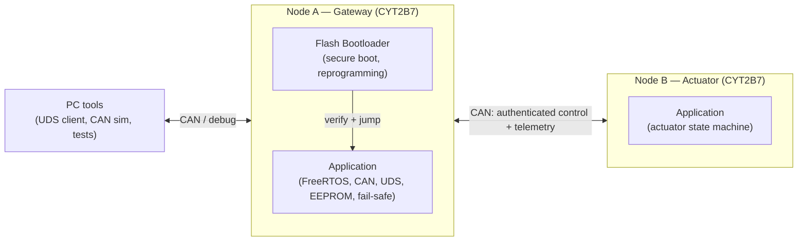
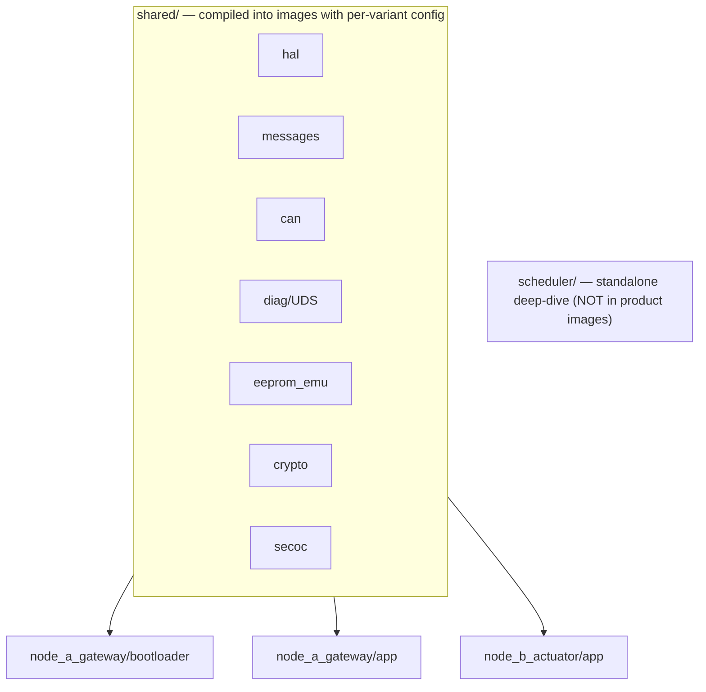

# Software architecture overview

**System:** a 2-node automotive body-domain network on Infineon TRAVEO™ T2G (CYT2B7).
**Audience:** this doc is both the engineering reference and the spine of the blog series.
**Status:** living document. Addresses/mechanism names marked *(verify in TRM)* are to be
confirmed against the Infineon Technical Reference Manual and security application notes.

> Scope discipline: the *full* architecture is designed here; implementation is **staged**
> (see §8). The design existing on paper is itself a deliverable — an architect is judged
> on it as much as on code.

---

## 1. System context

Two ECUs on one CAN bus:

- **Node A — Gateway.** The rich node. Has a **flash bootloader (FBL) + application**,
  secure boot, UDS diagnostics, signal aggregation, crypto offload to the Cortex-M0+.
- **Node B — Actuator.** Application only. Door/light/window state machine; publishes
  sensor data, consumes authenticated commands.



---

## 2. Two design axes

The codebase is organised on two axes, which is what the repo layout expresses:

1. **Node** — which ECU (A gateway, B actuator).
2. **Image** — which program on that ECU (**bootloader** or **application**).

Shared driver/logic modules are compiled into each image with a **per-variant config**.
Same source, different configuration — not forked copies, not `#ifdef` spaghetti.



---

## 3. Node A image architecture (bootloader + application)

### 3.1 Responsibilities

| Concern | Bootloader (FBL) | Application |
|---|---|---|
| Kernel | super-loop / minimal cooperative tick — *deliberately* not preemptive | **FreeRTOS** |
| CAN | polled, minimal static config | interrupt-driven, full config |
| UDS (diag) | programming services (session, security access, request/transfer/exit, routine, reset) | read-data / DTC / routine services |
| Crypto | image signature/hash **verify** only | SecOC MAC, key handling |
| Secure boot | **owns app verification** before jump | n/a |
| EEPROM | read config only (if needed) | full read/write with wear-levelling |
| Size/trust | kept small on purpose — minimal attack surface | larger, feature-rich |

### 3.2 Boot flow and the no-init handshake

1. **ROM secure boot** verifies the FBL (root of trust — see §5). *(verify in TRM)*
2. FBL starts. Reads the **no-init shared RAM** handshake region to decide: enter
   programming mode, or boot the app.
3. To boot the app: FBL **verifies the app image** (hash + signature), then performs the
   jump — relocate **VTOR** to the app vector table, set **MSP** from the app's initial
   stack pointer, branch to the app reset vector.
4. The app, on a reprogramming request (UDS), writes a flag to the no-init region and
   resets; the FBL sees it and stays in programming mode.

### 3.3 No-init shared RAM — the ECC gotcha

The handshake region is a `.noinit` section the startup code must **not** clear, so it
survives warm/soft resets. But TRAVEO™ T2G SRAM is **ECC-protected**, and reading
*uninitialised* ECC RAM can raise a fault. *(verify in TRM)* So the design is:

- **Cold boot (power-on):** prime the region once (write to establish valid ECC), then
  set a "valid" signature so subsequent boots know the data is real.
- **Warm/soft reset:** preserve the region untouched; the valid signature gates its use.

This is a real architect-level detail and a planned ADR once implemented.

---

## 4. RTOS strategy

- **Application RTOS = FreeRTOS.** Proven, free, supported on TRAVEO™ T2G via ModusToolbox.
  The product depends on a vetted kernel, not on my own.
- **Custom scheduler = standalone deep-dive** (`scheduler/`). It is an educational module —
  a from-scratch preemptive scheduler I can take risks with and dissect publicly. It is
  **not** linked into any product image. It also anchors the **EP.14 comparison**: run a
  representative task set on my scheduler vs FreeRTOS and compare design tradeoffs honestly.
  - This decoupling is deliberate: it lets the scheduler be ambitious without endangering
    the product, and keeps the "I understand what FreeRTOS hides" story intact.

See ADR-0005.

---

## 5. Security architecture

Principle: **use vetted primitives, architect around them.** No hand-rolled crypto.

- **Primitives:** hardware crypto block (AES/SHA/ECC/TRNG) via Infineon's crypto driver,
  with crypto offloaded to the **Cortex-M0+**. (mbedTLS or AUTOSAR Csm/Crypto are the
  alternatives — see ADR-0006.) `shared/crypto` is a thin wrapper exposing a clean service
  interface; it does not implement algorithms.
- **Secure boot is two layers:**
  1. *Root of trust (ROM):* the immutable boot ROM verifies the FBL using a key whose hash
     lives in eFuse/secure flash. Configured, not written. Without this, everything above
     is theatre. *(verify in TRM)*
  2. *App verification (FBL):* the bootloader verifies the application image before jumping
     — image manifest, hash, signature. This I design and implement.
- **Bus security (SecOC-style):** `shared/secoc` adds MAC + freshness to control messages
  between Node A and Node B, using the M0+ crypto service. Replay/freshness handling is an
  explicit design topic.
- **Key handling:** storage, lifecycle, and what is secret vs public is a design section,
  not an afterthought — and a strong interview talking point.

See ADR-0006. A consolidated threat model lands in EP.25.

---

## 6. Memory map (confirmed against the BSP linker)

The board corrected an earlier assumption: TRAVEO™ T2G is **dual-core at boot**, so code
flash is *not* a flat FBL+app split from `0x1000_0000`. The ROM starts the **CM0+**, whose
prebuilt image occupies the first 128 KB; the CM0+ then starts the **CM4** at `0x1002_0000`.
Our FBL is the CM4 image, and the app lives **above** it (the FBL stays small).

```
Code Flash (1 MB)  @ 0x1000_0000
  ┌───────────────────────────────────────────┐ 0x1000_0000
  │ CM0+ prebuilt           128 KB            │  ROM→CM0+ boot; CM0+ starts CM4 (FLASH_CM0P_SIZE)
  ├───────────────────────────────────────────┤ 0x1002_0000
  │ Bootloader (FBL, CM4)   128 KB            │  CM4 vector table / entry; CM0+ starts CM4 here
  ├───────────────────────────────────────────┤ 0x1004_0000
  │ Application (CM4)        ~832 KB           │  app vector table; FBL sets VTOR here and jumps
  └───────────────────────────────────────────┘ 0x1011_0000

Work Flash (96 KB) @ 0x1400_0000
  ┌───────────────────────────────────────────┐
  │ EEPROM-emulation sectors                  │  wear-levelling over rotated sectors
  └───────────────────────────────────────────┘

SRAM (128 KB)      @ 0x0800_0000
  ┌───────────────────────────────────────────┐ 0x0800_0000
  │ CM0+ RAM                ~32 KB            │
  ├───────────────────────────────────────────┤ 0x0800_8000
  │ CM4 RAM (.data/.bss/stack/heap)           │  the FBL + app share this (they don't run at once)
  ├───────────────────────────────────────────┤
  │ .noinit shared handshake region           │  preserved across warm reset; ECC-primed on cold boot
  └───────────────────────────────────────────┘ 0x0802_0000
```

Linker scripts per image enforce these regions; the FBL/app split and VTOR relocation are
driven from here. The **app is a CM4-only image** relocated to `0x1004_0000` (no CM0+
prebuilt of its own — the FBL's image already booted CM0+). This map is a first-class
artifact (and a blog chapter — "the design doc said flat; the silicon said dual-core").

---

## 7. Build, test, quality

- **Host-testable shared logic** (`messages`, `eeprom_emu`, `scheduler` core, `secoc`
  framing, `crypto` wrapper logic) builds and unit-tests on x86 under CI, with chip code
  behind `shared/hal` interfaces and host fakes (ADR-0001).
- **MISRA C:2012** for production C; cppcheck in CI; documented deviations (ADR-0003).
- **Unity** for host unit tests; **GitHub Actions** runs build + tests + static analysis on
  every push.

---

## 8. Staged delivery (MVP first)

Design is whole; build is layered. Each milestone is publishable.

| Milestone | Content |
|---|---|
| **M0** | Repo + host CI + MISRA (done). Architecture doc + ADRs (this). |
| **M1 — FBL MVP** | FBL boots, reads no-init handshake, jumps to a minimal app (VTOR/MSP). ROM secure boot configured. *No reprogramming yet.* |
| **M2 — App on FreeRTOS** | Minimal app under FreeRTOS: CAN up, a task or two, fail-safe watchdog. |
| **M3 — Reprogramming** | UDS programming services in the FBL; PC-side flash tool drives a download. |
| **M4 — App secure boot** | FBL verifies app signature before jump; image manifest + key handling. |
| **M5 — Second node + SecOC** | Node B app online; authenticated control messages A↔B. |
| **M6 — Resilience** | Fault injection, safe-state, threat-model write-up. |
| **(parallel) Scheduler** | Standalone scheduler deep-dive + FreeRTOS comparison, on its own track. |

---

## 9. Relationship to the roadmap

This revises `docs/roadmap.md` upward: the bootloader becomes its own arc, secure boot
expands beyond a single episode, and the custom scheduler moves to a parallel standalone
track rather than being the app kernel. The roadmap's episode list should be re-aligned to
these milestones (a separate task — not yet done).

## 10. Open items to verify in the TRM / app notes

- Exact ROM secure-boot mechanism, key-hash storage, and lifecycle stages.
- ECC behaviour on uninitialised SRAM reads and the correct `.noinit` priming pattern.
- Flash region/address specifics and any FBL placement constraints.
- Crypto driver vs mbedTLS vs AUTOSAR Crypto — final pick for `shared/crypto`.
