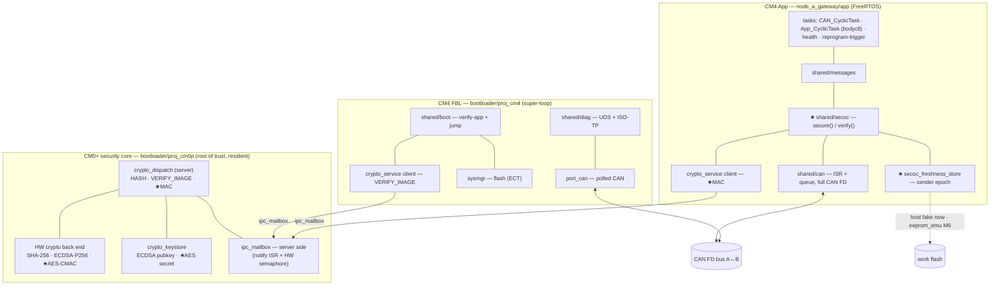
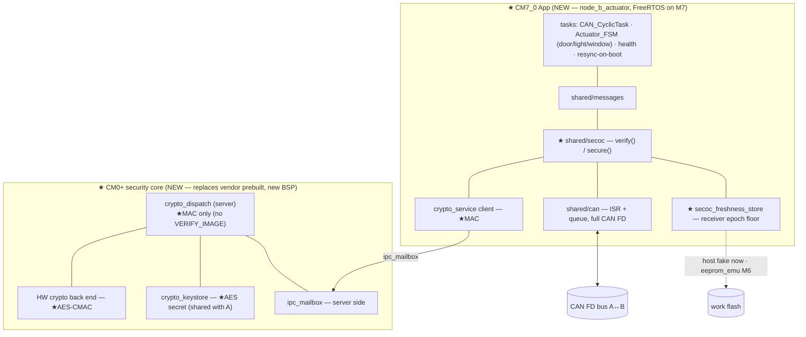
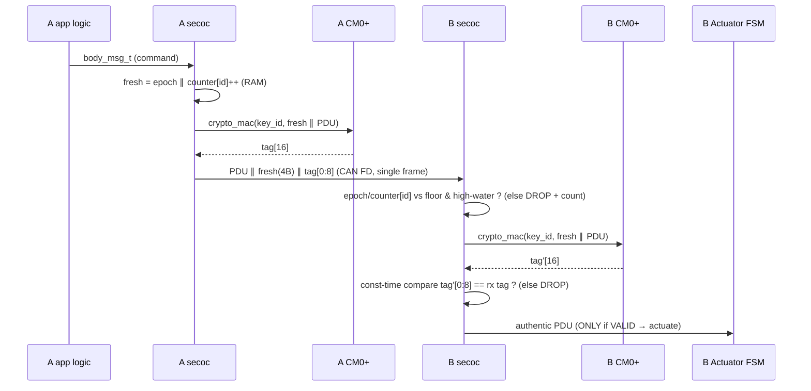

# M5 node software architecture with SecOC

**Status:** implemented (host CI-green), bench-pending. ADR-0021 **accepted** and realized:
the host-testable core (frame, freshness, resync, MAC framing, keystore, MAC client) is built and
passing all five Unity suites; the target seams (both CM0+ MAC handlers + shared secret, the Node B
CM0+ mailbox server + linker reservation, the CM7 IPC port binding + MPU non-cacheable region, and
the `secoc_app`/actuator-FSM CAN integration on both nodes) are authored with `@impl` tags and
awaiting on-silicon bring-up. Decisions locked this session and carried into ADR-0021:
**D3 = per-ID freshness counter**, **D5 = receiver-reset resync included in M5**,
**D7 = telemetry authenticated + symmetric-key handling both owned by ADR-0021**; plus the ADR-0021
strengthenings **Data-ID-in-MAC** (cross-ID substitution fix), **counter-rollover epoch-bump**, and
the stated **u16-epoch** limitation. Full status: ADR-0021 Review history.

> This document shows **how SecOC integrates with the existing modules** (CAN, UDS/ISO-TP, crypto
> service, FreeRTOS, boot) on each node, the **node hardware asymmetry** (Node B is a different
> TRAVEO™ part), the **Node B folder restructure** needed before bring-up, and the SecOC data path
> itself. It is the map that the `@impl`/`@test` traceability tags point back to
> (`docs/traceability-convention.md`); the decision record is ADR-0021 and the requirements are
> `docs/requirements/secoc.md`.

Legend: **★ = new or extended for M5.** Unmarked items already exist (M2–M4).

---

## 1. The shape in one sentence

SecOC is a **thin per-message shim between `shared/messages` and `shared/can`** that runs in the
**application** of both nodes, making the app a **second client of the M0+ crypto service** the FBL
already uses — reusing `ipc_mailbox` + `crypto_dispatch` unchanged and filling the reserved
`CRYPTO_OP_MAC` slot. The transport/dispatch stacks do not change shape; SecOC is additive on both
the app axis and the cross-core axis. The one place this stops being "just config" is Node B, which
is a **different silicon family** and needs its own bring-up (§3, §4).

---

## 2. Node hardware asymmetry (this drives everything target-side)

| | **Node A — Gateway** | **Node B — Actuator** |
|---|---|---|
| Kit | `CYTVII-B-E-1M-SK` | `KIT_T2G-B-H_LITE` (Body High Lite) |
| MCU | CYT2B7 (**Body Entry**) | **CYT4BF** (**Body High**) *(exact part suffix: confirm from BSP)* |
| App core | Cortex-**M4F** @ 160 MHz | Cortex-**M7** @ up to 350 MHz (CM7_0; CM7_1 unused in M5) |
| Security core | Cortex-M0+ @ 100 MHz | Cortex-M0+ @ 100 MHz |
| **Cache** | **none** (M4 has no L1 cache) | **CM7 has L1 I+D cache** → mailbox is MPU non-cacheable (ADR-0018 D6, §6.1) |
| Flash / SRAM | 1 MB / 128 KB | **8 MB / 1 MB** |
| CANFD | yes | yes (`MXTTCANFD_S40E`) |
| HW crypto | MXCRYPTO (AES/SHA/ECC) | MXCRYPTO (`CY_IP_MXCRYPTO` in `cyt4bf8cds.h`; PDL Crypto Core **V2** CMAC) |
| Images | 3 (CM0+ crypto, CM4 FBL, CM4 app) | 2 (CM0+ crypto, CM7 app) — **no FBL, no app secure boot** |

**Why this matters for the design, not just bring-up:** the host-testable `shared/` layer (secoc,
messages, crypto framing/dispatch) is **untouched** by the M4→M7 change — that is precisely the
payoff of the ADR-0001 no-vendor-headers discipline, and a clean "port across silicon for free"
story. Only the **target-only seams** move, and two of them move in load-bearing ways: the FreeRTOS
port (M4→M7) and the **cross-core mailbox cache coherency** (§6.1).

---

## 3. Node A — Gateway (rich node, unchanged stack + SecOC in the app)

Three images across two cores. The CM0+ security core is **resident from power-on** and serves
first the FBL (VERIFY_IMAGE at boot) then the app (MAC at runtime) — the two CM4 images never run at
once, so the single-outstanding transport (ADR-0018 D3) still holds.



**SecOC role:** sender of commands (`0x120` door, `0x121` light); verifier of Node B's authenticated
`FRESHNESS_SYNC` (`0x2F0`) and authenticated telemetry (`0x200`). Persists its own per-boot epoch.

**M5 changes (all ★):** one MAC row in the dispatch table, AES-CMAC + AES secret in the
keystore/back end, and the new `secoc` module + freshness-store port in the app. FBL untouched.

---

## 4. Node B — Actuator (different silicon; new stack)

Two images across two cores, **both new in M5**, on the Body High Lite part. No FBL, no app secure
boot — the root of trust is ROM→CM0+, and the M0+ core is where the secret key lives.



**SecOC role:** verifier of commands — actuates **only** on VALID; a bad MAC or stale freshness is
dropped, counted, and the FSM holds its last safe state. Sender of the authenticated
`FRESHNESS_SYNC` on boot (D5) and of authenticated sensor reports (D7). Persists its accepted-epoch
floor.

**The Node B lift is the biggest single item in M5:** a *custom M0+ crypto image* (dispatch loop +
AES-CMAC + secret key + "start CM7_0") on a **new BSP**, plus a **CM7 FreeRTOS app** (new port).
The layer diagram makes it look like "the same `shared/crypto`," but it is a full silicon bring-up
on a part the project has never built for.

> **Note on where the key lives:** the design reuses the M0+-offload pattern for consistency and
> portability. If the Body High part exposes a dedicated hardware security subsystem/HSM, that would
> be an even better home for the secret key — flagged as a *verify + possible enhancement*, but the
> baseline design does not depend on it.

---

## 5. Node B folder structure (multi-core MTB app — as built)

Body High Lite is a different device (**`CYT4BF8CDS`**, recipe **`cat1c`**) with its own BSP and
**two** images, so Node B is a **multi-core MTB application** — structurally like Node A's
`bootloader/` (a `proj_cm0p` + `proj_cm4` multi-core app), but semantically it is the whole node,
not a bootloader. Started from the MTB FreeRTOS-Blinky example for `KIT_T2G-B-H_LITE`; the Blinky
became `proj_cm7`, and a sibling `proj_cm0p` holds the crypto server.

**Layout:**

```
node_b_actuator/                         # = the multi-core APPLICATION root
├── Makefile                             # MTB_TYPE=APPLICATION; MTB_PROJECTS=proj_cm0p proj_cm7
├── bsps/TARGET_APP_KIT_T2G-B-H_LITE/    # ONE shared BSP (COMPONENT_CM0P + COMPONENT_CM7)
├── proj_cm0p/                           # CM0+ security core (CORE=CM0P / CM0P_0)
│   ├── Makefile                         # PROJECT; DISABLE_COMPONENTS=XMC7x_CM0P_SLEEP;
│   │                                    #   SOURCES += ../../shared/crypto/src/{crypto_dispatch,
│   │                                    #   crypto_msg,crypto_keystore}.c  (NO ipc_mailbox.c —
│   │                                    #   the CM0+ is the mailbox SERVER); fills flash_cm0p
│   └── src/                             # main_cm0p.c (start CM7 + dispatch loop), CMAC back end
└── proj_cm7/                            # CM7_0 actuator app (CORE=CM7 / CM7_0), FreeRTOS
    ├── Makefile                         # PROJECT; COMPONENTS=FREERTOS RTOS_AWARE;
    │                                    #   DISABLE_COMPONENTS=XMC7x_CM0P_SLEEP; SOURCES (per seam)
    │                                    #   += ../../shared/{messages,secoc}/src/*.c +
    │                                    #   ../../shared/crypto/src/{ipc_mailbox,crypto_msg,
    │                                    #   crypto_service}.c  (client → includes ipc_mailbox.c)
    ├── config/ (FreeRTOSConfig.h)  src/  ...
```

Notes:
- **`shared/` via relative `SOURCES=`/`INCLUDES=`**, same mechanism as Node A — from
  `node_b_actuator/proj_cm7/` that is `../../shared/...` (2 levels to repo root), and
  `CY_GETLIBS_SHARED_PATH=../../` resolves the **single repo-root `mtb_shared/`** all variants share.
- **Client vs server split** (mirrors Node A): the CM7 app is the mailbox **client** and links
  `ipc_mailbox.c`; the CM0+ is the **server** and does *not* — it reads/writes the shared mailbox
  region directly (ADR-0018).
- **CM0+ image combine:** `DISABLE_COMPONENTS=XMC7x_CM0P_SLEEP` (the cat1c vendor prebuilt) on both
  projects, so our `proj_cm0p` image fills the CM7 linker's `.cy_m0p_image` / `flash_cm0p` window —
  the cat1c equivalent of Node A's `CM0P_SLEEP` mechanism.
- **Libraries:** `mtb_shared/` is a **gitignored cache** regenerated by `make getlibs`; per-project
  `deps/*.mtb` locators are the committed source of truth. Node B's newer versions
  (`recipe-make-cat1c`, `mtb-hal-t2gbh8m`, `mtb-pdl-cat1 3.23.0`, …) coexist **alongside** Node A's
  pinned versions in the one cache — Node A's proven versions are never upgraded.
- **Node B needs its OWN mailbox map (IPC-seam artifact).** `shared/crypto/include/ipc_mailbox_map.h`
  is Node-A-specific — its address `0x0801F500` sits in CYT2B7's 128 KB SRAM (pinned to
  `fbl_cm4.ld`) and `IPC_CRYPTO_CHANNEL = 4` is CAT1A. Node B must author a fresh map: an address in
  its 1 MB SRAM **reserved in both the `proj_cm0p` and `proj_cm7` linker scripts** (ADR-0018 D5),
  living in the CM7 linker's existing **`ram_noncache`** region (`_base_SRAM_NON_CACHE`) to satisfy
  the D6 non-cacheable requirement for free, with the correct **CAT1C** IPC channel. The Seam-1
  `main_cm0p.c` therefore does **not** include the Node A map; the mailbox arrives at the crypto seam.

---

## 6. What is reused vs new/extended

| Module | Node A | Node B | M5 status |
|---|---|---|---|
| `ipc_mailbox` (transport) | reuse | new binding | **unchanged code**; new client roots; **§6.1 cache** on B |
| `crypto_msg` (framing) | extend | extend | ★ add MAC request/tag helpers |
| `crypto_dispatch` (server) | extend | new image | ★ fill reserved `CRYPTO_OP_MAC` row |
| `crypto_keystore` | extend | new | ★ add AES-secret key type |
| HW crypto back end | extend | new | ★ AES-CMAC alongside SHA/ECDSA |
| `crypto_service` client | reuse (FBL) + ★new (app) | ★new (app) | ★ `crypto_mac()` sibling of `crypto_verify_image()` |
| `shared/secoc` | ★new | ★new | ★ frame + freshness + verify + resync |
| `secoc_freshness_store` port | ★new | ★new | ★ host fake now / eeprom_emu M6 |
| `shared/can`, `shared/messages` | reuse | reuse | unchanged source; B needs CANFD target port on new BSP |
| `shared/diag`, `shared/boot`, `sysmgr` | reuse | — (absent) | Node B has none |
| FreeRTOS + tasks | reuse (M4 port) | ★new (M7 port) | new `Actuator_FSM` task; M7 kernel port |

### 6.1 The CM7 cache-coherency consequence (new, Node B only) — resolved: ADR-0018 D6

ADR-0018's shared-RAM mailbox was designed on a **cacheless** M4. On Node B the app core is an **M7
with L1 D-cache**, so the cross-core mailbox is no longer automatically coherent between CM7 and
CM0+: a CM7 write can sit in the D-cache (invisible to CM0+) and a CM7 read can return a stale line.
**Decision (ADR-0018 D6):** the mailbox region + cross-core flags are placed in an **MPU
Non-cacheable region**, set once at CM7 startup — *not* per-transaction cache maintenance. Rationale:
the mailbox is touched once per CAN command, so non-cacheability costs nothing measurable, and it
makes coherency **structural** — the transport code stays byte-identical to Node A's and no caller
can forget a clean/invalidate. Explicit `SCB_*DCache_by_Addr` maintenance is the documented fallback
only. The ADR-0018 D2 protocol is unchanged; D5's mailbox placement gains a per-node memory-attribute
requirement. MPU region granularity (ARMv7-M PMSAv7: power-of-two, ≥32 B, aligned) is a Node B
bring-up verify item.

---

## 7. SecOC data path

### 7.1 Insertion point (both nodes)

On the existing app CAN path (`BUS → ISR → raw_frame_q → CAN_CyclicTask → dispatch → body_msg_t`),
SecOC is a **filter keyed by a per-ID config flag** (config over `#ifdef`, ADR-0004 style):

- **TX (generate):** `pack_*` builds the authentic PDU → `secoc_secure()` appends freshness + MAC →
  `can_hal.send()`.
- **RX (verify):** `secoc_verify()` checks the trailing freshness + MAC and strips them → only then
  `body_decode()` / `unpack_*` runs. A failed verify never reaches decode/actuation.

`shared/secoc` reaches in exactly **two** directions (enforced by the `secoc_core` rule in
`checks/rules.yml`): **`crypto_mac()`** (down to the M0+) and the **`secoc_freshness_store_if_t`
port**. It never touches CAN transport symbols, the raw mailbox, or `eeprom_emu`.

### 7.2 Secured frame layout (single CAN FD frame)

```
CAN FD data field (≤ 64 B) — e.g. door command (0x120), 1-byte payload:
┌───────────────────────┬─────────────────────┬────────────────────────┐
│ Authentic PDU (P B)   │ Freshness (4 B)     │ Truncated MAC (8 B)    │
│  e.g. DOOR_UNLOCK      │ epoch(u16)∥ctr(u16) │  AES-CMAC[0..8)        │
└───────────────────────┴─────────────────────┴────────────────────────┘
MAC input   = Freshness(full 4 B) ∥ Authentic-PDU
Transmitted = Authentic-PDU ∥ Freshness(full 4 B) ∥ MAC[0..8)      (~13 B here)
```

CAN FD's 64-byte frame lets payload + freshness + MAC ride in **one** frame — no secondary MAC PDU,
no on-bus freshness truncation/reconstruction (the Classic-CAN SecOC headaches).

**MAC primitive (resolved — HW CMAC available):** AES-CMAC computed on the M0+ via the PDL's
**Crypto Core V2 CMAC** (`Cy_Crypto_Core_V2_Cmac`) — a vetted implementation, no hand-rolled
subkey/padding (ADR-0006). **Verified:** Node B's device header `cyt4bf8cds.h` defines
`CY_IP_MXCRYPTO` and the PDL ships the CMAC v2 driver, so the earlier `bsp.mk` `IPBLOCKS` omission
was a false alarm — Node B has an MXCRYPTO block (final CYT4BF-datasheet cross-check is a low-risk
formality). mbedTLS `mbedtls_cipher_cmac` stays the documented software fallback but is no longer
expected. The offload architecture is unchanged regardless — the secret key stays in the M0+ TCB and
CMAC is computed there. On-silicon correctness proven against **NIST SP 800-38B known-answer
vectors**; back end is target-only (ADR-0017 layer 4), faked on host. To be formalized as
**ADR-0021 D1**.

### 7.3 Freshness scheme — per-ID counter, shared per-boot epoch (D3 + D4)

Freshness value = **`epoch (u16) ∥ counter (u16)`**, where:

- **`counter` is per CAN-ID** (D3): each authenticated message ID carries its own RAM counter, so a
  genuine, slightly-reordered frame on ID *Y* is not rejected as stale because ID *X* moved ahead.
- **`epoch` is per node, per boot** — persisted once per boot via the freshness-store port and
  incremented each boot (D4). It is **shared across all of that node's IDs**, so per-ID counters do
  **not** multiply flash writes: still **one write per boot**, regardless of how many IDs.
- **Persist order (the correctness invariant):** on boot `load(E)` → use `E` → `commit(E+1)` *before*
  spending `E`. A brown-out can waste an epoch, never reuse one.
- **Receiver accept rule** (per sender): reject if `epoch < floor`; adopt and accept if
  `epoch > current_epoch` (reset per-ID high-water); within the current epoch accept iff
  `counter > high-water[id]` (tolerates gaps from dropped frames). The **floor** is the one
  persisted value on the receiver; per-ID high-water lives in RAM.
- **Receiver-reset replay (D5)** is closed because the receiver's boot raises `floor = persisted+1`
  and the authenticated `FRESHNESS_SYNC` forces the sender's shared epoch up to that floor — every
  old-epoch frame (any ID) then falls below the floor.

### 7.4 One command, end to end



### 7.5 CAN ID / band allocation (extends ADR-0002)

| ID | Direction | Traffic | SecOC |
|---|---|---|---|
| `0x120` DOOR_CMD | A → B | command | ★ protected |
| `0x121` LIGHT_CMD | A → B | command | ★ protected |
| `0x200` SENSOR_RPT | B → A | telemetry | ★ protected (D7) |
| `0x2F0` FRESHNESS_SYNC *(proposed)* | B → A | SecOC mgmt (D5) | ★ protected (authenticated floor) |

`0x2F0` sits in a new SecOC-management sub-band at the top of `0x2xx` — an ADR-0002 extension
mirroring the M3 diagnostic-band extension.

---

## 8. Scope consequences & honest limitations

1. **Node B is a full silicon bring-up on a new part** (Body High Lite / CM7), not a config variant:
   new BSP, new FreeRTOS port, new CM0+ image, and the §6.1 cache concern. This is the milestone's
   largest cost and the reason bring-up precedes SecOC integration on Node B.
2. **Node B has no app secure boot in M5.** The M0+ offload protects the secret key from
   *disclosure* — a CM7 memory bug cannot read it. But a *fully compromised* Node B app can still
   call the MAC oracle and forge — inherent to **symmetric** SecOC (any key-holder can forge), not a
   flaw introduced here. Node B's own image verification is a future item.
3. **Symmetric shared key** is portfolio-acceptable, stated honestly: real fleets provision per-ECU
   keys from a backend key master (KDF), never one shared secret. Design-essay scope.
4. **Per-message M0+ round-trip on the control path.** AES-CMAC over ~13 B is microseconds; the cost
   is the IPC round-trip. Each node mostly MACs one direction (A generates, B verifies), so mailbox
   contention is low — but latency vs the control budget is a **verify-on-silicon** item, and a
   future concurrent crypto user would revisit ADR-0018 D3.

---

## 9. Host/target split (ADR-0001)

| Host-testable (GCC + Unity) | Target-only (behind ports) |
|---|---|
| all of `shared/secoc` (frame, freshness, verify, resync), `messages` | `can_hal` target impls (M4 + **new M7/BSP**) + RX ISR |
| `crypto_mac` framing + dispatch row, `crypto_service` MAC client flow | each node's **M0+ crypto image**, the HW AES-CMAC |
| `secoc_freshness_store` **fake** (volatile map) | the **secret key bytes**; the `eeprom_emu` backing (M6); **M7 mailbox cache handling (§6.1)** |

The M4→M7 change touches **only** the right column — the entire left column ports unchanged.

---

## 10. Traceability hooks

- Decisions: **ADR-0021** (SecOC protocol, framing, per-ID freshness, resync, symmetric-key
  handling — D7 keeps the key in this ADR, no ADR-0022).
- Requirements: **`docs/requirements/secoc.md`** — `REQ-SECOC-001..013` (008 = resync is now
  `@impl`, not design-only; 013 = telemetry authentication, added by D7).
- `@impl`/`@test` tags link code/tests to those IDs; design-only items (Node B secure boot,
  provisioning lifecycle, latency) are `@design-only`.
- Layer rule: a `secoc_core` entry in `checks/rules.yml` forbids `shared/secoc/**` from referencing
  `ipc_transact`, `crypto_dispatch`, `Cy_CANFD*`, `eeprom_*`, or FreeRTOS symbols.
- ADR-0018 **D6** (written): MPU-scoped non-cacheable mailbox on Node B; D-cache stays on for all
  other SRAM (§6.1).
```
