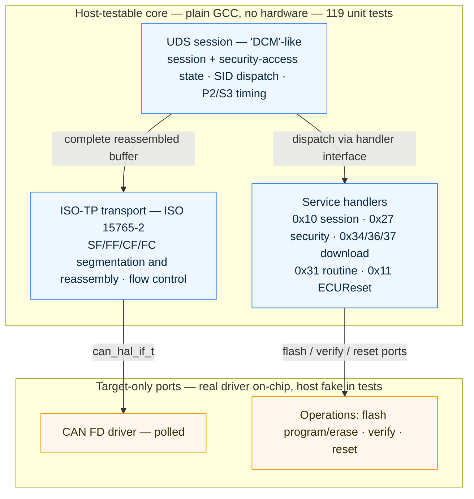
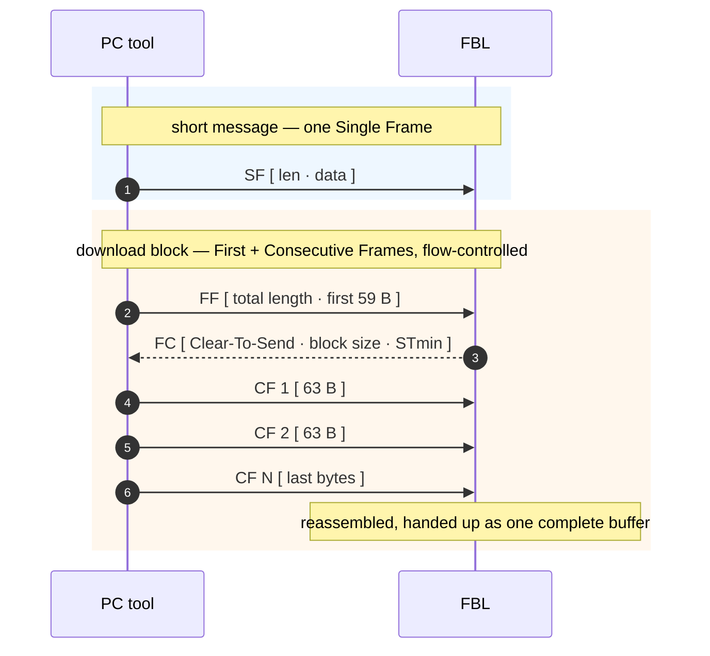
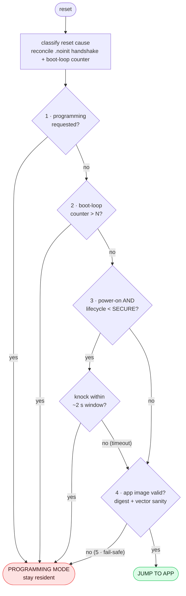
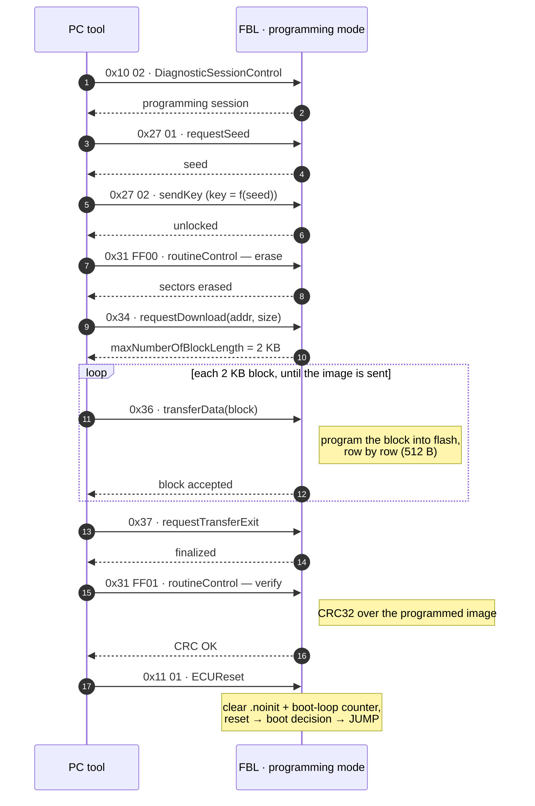
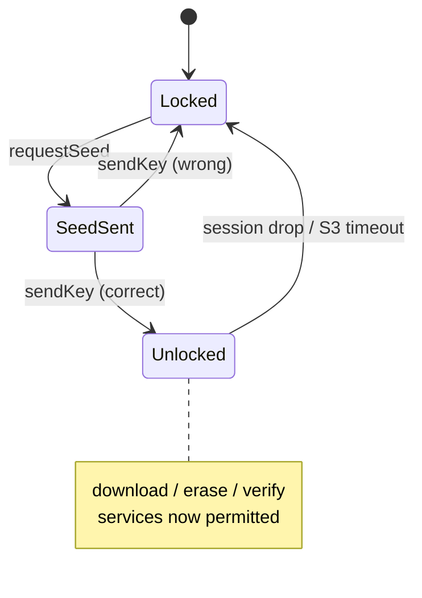
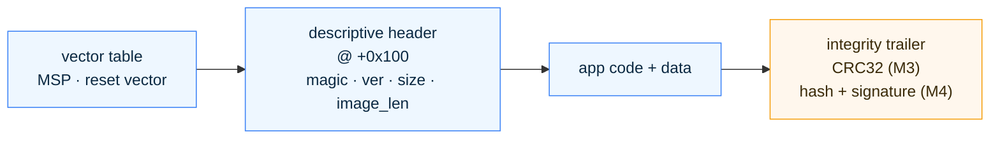
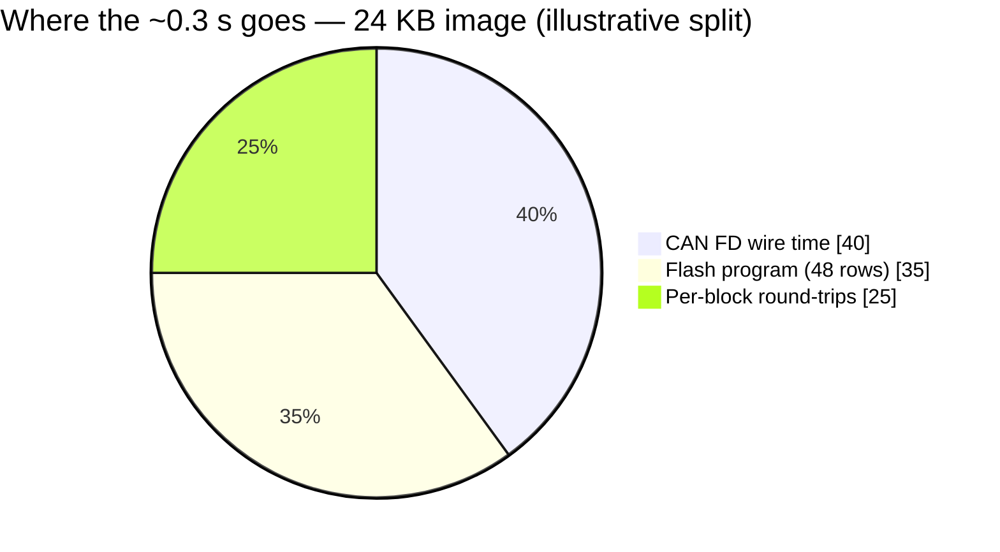
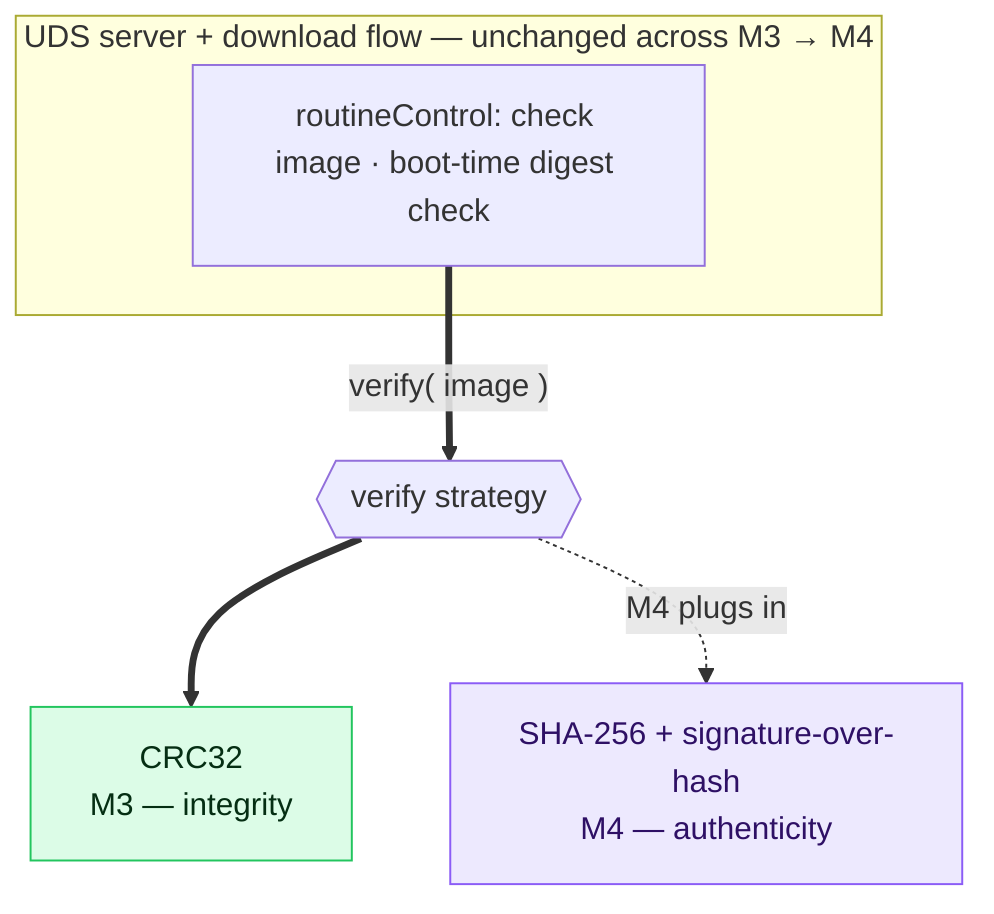

# Designing a Reprogrammable Bootloader: UDS Over CAN on TRAVEO™ T2G

*Part of a portfolio series building a two-node automotive body-domain network on
Infineon's TRAVEO™ T2G. M1 got the flash bootloader booting and jumping to an app;
M2 brought the application up on FreeRTOS. M3 — this post — makes the bootloader
**reprogrammable over the bus**: a PC tool drives a UDS download that writes a new
application image into flash, which the bootloader verifies and boots.*

The M1 and M2 write-ups were bring-up logs — *"here's what the silicon did that the
datasheet didn't."* M3 is different. The interesting part isn't any single register;
it's the **architecture**. Reprogramming is where a bootloader stops being a boot
sequence and becomes a small, layered protocol stack with a security boundary, a
transport, and a state machine that must never leave a half-written app looking
bootable. So this post is a **design essay**: how the diagnostic stack is layered,
how the boot decision and the download sequence work, what the reprogramming
actually *costs* in throughput, and how you'd drive and verify it.

> *Diagrams below are Mermaid — they render natively on GitHub and at
> [mermaid.live](https://mermaid.live); for Medium, export each to PNG/SVG and drop
> it in as an image.*

---

## 1. The shape of the problem

A field-updatable ECU has to answer an awkward question: *how do you replace the
software while the software is running?* The bootloader (FBL — flash bootloader) is
the answer. It's a small, separate program that can:

1. Talk to a tool over the vehicle bus (here, CAN FD).
2. Speak enough of the diagnostic protocol (UDS, ISO 14229) to be commanded through
   a reflash.
3. Erase and program the application's flash.
4. **Refuse to boot a half-written or corrupt app** — the single most important
   safety property.

The design tension that shapes everything: the FBL must be **small** (minimal
attack surface, it's the root of the update trust chain) but must also contain a
**real protocol stack**. The way you keep both is layering — and layering is only
worth anything if you enforce it.

---

## 2. Bootloader architecture — CAN and the diagnostic stack

The FBL is deliberately a **super-loop, not an RTOS** (the application runs
FreeRTOS; the bootloader does not — smaller, simpler, less to trust). Everything
below runs synchronously inside one polling loop.

I borrowed the **AUTOSAR diagnostic layering** as a reference model — *without*
implementing AUTOSAR. Adopting a proven layering and justifying it is the architect
move; dragging in a generated BSW stack for a 2-node hobby-scale ECU is not. Four
layers, strict one-directional dependencies (each layer depends only on the
interface below it, never sideways, never upward):



*Read the arrows as "calls / depends on." Every dependency points down or into an
interface — never sideways between handlers, never upward. The blue band is pure
logic that unit-tests on a PC; the amber band is the only code that needs the chip,
and it sits behind a port with a host fake. That line is where the host tests stop
and bring-up begins — and, as it turned out, exactly where every silicon bug lived.*

**The two seams that matter most are the bottom (CAN) and the middle (Diag), so
let me emphasise those.**

### CAN — polled, not interrupt-driven

The application reaches CAN through an ISR → queue → task pipeline. The FBL's driver
is **polled**: one `can_recv()` call per super-loop iteration, no interrupts, no
queue. This is a deliberate fork, not laziness. A super-loop has no scheduler to
hand an ISR's work to, so an interrupt-driven driver would just need an artificial
"pending" flag that the loop polls anyway — you've added an ISR and kept the poll.
Polling is the honest design for this execution model.

The channel itself is shared, by design, with the application: **CAN FD, 500 kbit/s
nominal / 2 Mbit/s data phase with bit-rate switching**, the same physical pins and
bit timing the app uses. The bootloader must not invent parameters the application
would have to contradict.

One subtlety worth calling out, because it's the difference between "it works" and
"it works until a firmware burst": the RX FIFO is only **8 frames deep**. During a
multi-frame download block, ~30+ consecutive frames arrive back-to-back. If the
super-loop ever *blocks* — say, a `delay()` to blink a heartbeat LED — the FIFO
overflows and reassembly silently fails. The rule that falls out: **never block in
the super-loop.** Poll the transport every iteration; drive the heartbeat off a
timestamp, not a delay. (I learned this the direct way — the first download stalled
on the first 2 KB block. The fix was purely *how often* the existing poll runs — a
nice vindication of choosing a poll-based transport in the first place.)

The transport itself is standard ISO-TP: short messages ride a single frame; long
ones (a download block) are segmented into a first frame + consecutive frames, paced
by a flow-control frame from the receiver. It hands the layer above a *complete*
buffer and nothing less:



### Diag — the layered stack, and why the layering pays

The value of the strict layering is concrete and testable: **the transport hands
the session a complete, reassembled buffer and never a CAN frame; the session
dispatches on service ID and never touches a frame; a service handler touches only
its request/response buffers and the operations back-end, never CAN, never ISO-TP,
never another handler's state.**

The smell you're designing against — the classic hand-rolled-bootloader failure —
is CAN or flash or timing calls leaking upward into the protocol logic. When that
leak happens, the "protocol" can only be tested on the target, one reflash at a
time. When it *doesn't*, the entire diagnostic core — ISO-TP reassembly, the
session and security state machines, service dispatch, the download bookkeeping,
the CRC verify — compiles and unit-tests **on a PC with plain GCC**, no hardware.
For M3 that was **119 tests, green before the board.**

Here's the payoff, and it's the sentence the whole milestone exists to earn:
**across seven on-hardware bring-up seams, not one silicon fault required a change
to the host-tested core.** Every bug lived in a target port (CAN extraction, flash
geometry, a write-safety register) or the runtime environment (an interrupt left
masked, the super-loop cadence) — exactly the seam the host tests can't reach, and
exactly where the layering had drawn the boundary. That's not luck; that's what the
boundary is *for*.

Four design patterns, named because they're defensible in an interview:

- **Layered architecture** with enforced dependency direction (transport ← session
  ← handlers ← operations).
- **Strategy** for the image *verify* — CRC32 today, a signature check next
  milestone, selected behind one interface so the security upgrade is a plug-in,
  not surgery on the download flow.
- **State** for the session-type and security-access machines (host-tested in
  isolation with a fake clock).
- **Command/handler table** for service dispatch — adding a service is adding a
  handler behind one interface, not editing the server.

---

## 3. The boot decision tree — and the `.noinit` handshake

Before the FBL can *download* anything, it has to decide, once per reset, whether to
run the app, stay resident for programming, or fail safe. This decision is the
skeleton the reprogramming hangs on.

### The decision, evaluated once per reset



Ordering is the whole argument. The programming request is first, so a *perfectly
good* app can still ask to be reflashed (the essence of a field-updatable ECU). The
boot-loop fallback precedes the jump, so a valid-but-crash-looping app is caught
before it runs again. The knock window precedes the app check, so a tool can grab
the bootloader *before* a valid app boots. And step 5 — **invalid or blank app ⇒
stay in the FBL, never jump** — is the single most important safety property in the
system. A half-written app must never execute.

### The `.noinit` handshake — how the app asks to be reflashed

Steps 1 and 5 lean on two pieces of persisted state. The first is a **`.noinit`
shared-RAM handshake**: a small region the C startup is told *not* to clear, so it
survives a warm/soft reset. The application writes a "please stay in the bootloader"
request there and triggers a software reset; on the next boot the FBL reads that
intent and stays resident.

Two silicon realities make this less trivial than it sounds:

- **The SRAM is ECC-protected.** Reading a location never written since power-on can
  raise a fault. So the FBL can't blindly read an "uninitialised" handshake — it
  classifies the reset cause first, and only *reads* the region on causes that
  provably retain it (software/watchdog/debug); on power-on or hibernate it *primes*
  the region (writes it to establish valid ECC) before trusting it. The two
  misclassification directions aren't symmetric — "prime when you should have read"
  loses the handshake (safe: fall back to boot-app); "read when you should have
  primed" faults (dangerous) — so the classification is deliberately **prime-biased**.

  ```mermaid
  flowchart LR
      RC([reset cause]) --> D{provably<br/>retains SRAM?}
      D -->|"software / watchdog / debug"| RD["READ + validate<br/>magic + CRC32"]
      D -->|"power-on / hibernate / unknown"| PR["PRIME<br/>write to set ECC,<br/>init to boot-app default"]
      RD -.->|"magic/CRC fail"| PR
      classDef prime fill:#fff7ed,stroke:#f59e0b,color:#3a2a08;
      class PR prime;
  ```

  *Prime-bias in one picture: only causes that are **certain** to retain the region
  map to READ; everything ambiguous maps to PRIME, and even a "READ" region that
  fails its magic/CRC check falls through to PRIME. An unforeseen reset cause is safe
  by construction.*

- **`.noinit` is a shared catch-all.** Pinning "the `.noinit` section" at a fixed
  address doesn't pin *your* variable there — the BSP's own `.noinit` contributors
  land first and push yours to an offset that only matches across the two images by
  coincidence. The fix is to give the handshake its **own** named section, pinned
  and asserted at link time, honoured identically by both the bootloader's and the
  application's linker scripts.

The boot-loop counter (step 2) lives in the always-on **backup registers**, not
`.noinit` — it's FBL-private recovery state the application must not see or tamper
with, and it must survive hibernate (which powers down the SRAM domain). That
ownership split — app-writable request in `.noinit`, FBL-private counter in backup
registers — is the kind of boundary that's cheap to draw up front and expensive to
retrofit.

### The one interaction that bit back

Reprogramming closes a loop through this tree, and it exposed a genuine design bug
worth sharing because it's *exactly* the kind of thing that only shows up when two
correctly-designed rules meet. After a successful download the tool sends
`ECUReset`. The FBL's reset handler clears the `.noinit` programming-request (so
step 1 won't trap it resident) and resets — so the next boot can reach step 4 and
jump. But the boot-loop counter rule treats *"software reset without a
programming-request"* as a crash and increments. And the reset handler just cleared
the programming-request — the very signal that says *"this reset was deliberate."*
So every reflash-then-reset quietly incremented the crash counter, and after enough
cycles step 2 trapped a **perfectly valid, freshly-flashed app** in the bootloader.
The fix: an `ECUReset` is deliberate by definition, so its handler also clears the
counter — the "a deliberate reflash is not a crash" intent, applied where the
`.noinit` signal could no longer carry it. Clearing one signal to satisfy one
consumer had silently starved another that read the same signal.

---

## 4. The download sequence

With the stack and the boot decision in place, the reflash itself is a UDS
conversation. The PC tool drives it; the FBL's handlers respond. Every message rides
ISO-TP over the shared CAN FD channel (request ID `0x7A0`, response ID `0x7A8`).



Two design decisions inside this flow are worth pulling out.

**Security is a gate, not decoration — but be honest about what it gates.** The
`0x27` seed/key exchange is a real state machine, and it *does* gate the download
services — no unlock, no `requestDownload`:



But the M3 seed/key *transform* is deliberately trivial (a reversible operation with
a fixed constant). It demonstrates the **mechanism**; it is **not** cryptographic
security. This is the same honesty note that runs through the whole
project: the M3 CRC32 verify proves the image is **complete and uncorrupted** — the
real M3 risk, an interrupted flash — but CRC is **not authenticity**. Authenticity
is a *hash + signature-over-the-hash*, and it's the next milestone. The architecture
is ready for it: the verify is a Strategy behind one interface, and the image
trailer already reserves the signature slot. M4 flips the strategy; the download
flow doesn't change.

**Interrupted-download safety costs nothing new.** What happens if power drops
mid-download? Nothing special has to happen — the *existing* boot fail-safe (step 5:
invalid app ⇒ stay resident) already covers it. A partial image leaves the header
incomplete or the CRC trailer unwritten, and the boot-time digest check rejects it
on the next boot, automatically. The download bookkeeping's only added obligation is
to never let `requestTransferExit` report success on a gapped or short transfer.
There is no resumable-download machinery in M3 — a fresh `requestDownload` simply
restarts cleanly. The failure story rides the boot decision that already existed.

That safety rests on the **image layout**, which is worth a picture because it's
where M3 and M4 meet:



*The digest covers the blue span — `[base .. base + image_len)` — and stops exactly
at the trailer, so the integrity field is never inside the range it protects. The
trailer (amber) is excluded. Two consequences fall out for free: a truncated
download can't produce a valid trailer, so it can't pass; and **M4 inherits this
layout unchanged** — the hash is over the same blue span, the signature is over the
hash, and both live in the same still-excluded trailer. The verify algorithm
changes; the geometry doesn't.*

---

## 5. Reprogramming performance

Here's what it actually costs. Measured flashing the real M2 application image
(24 552 bytes of app, stamped with a header + CRC trailer and padded to the flash
row → **24 576 bytes, 48 program rows**) over the bench setup (a Vector VN1610
driving `python-can`, no CANalyzer license):

| Parameter | Value |
|---|---|
| CAN nominal / data bit rate | 500 kbit/s / **2 Mbit/s** (CAN FD, BRS on) |
| ISO-TP block size (BS) | 8 frames between flow-control frames |
| ISO-TP **STmin** | **0 ms** (no inter-frame separation) |
| transferData block size | **2048 B** (server-advertised `maxNumberOfBlockLength`) |
| flash **program** granularity | **512 B** row (one blocking `ProgramRow`) |
| flash **erase** granularity | **32 KB** large sector (8 KB small sectors at flash top) |
| image transferred | 24 576 B in **~0.3 s** |
| **transfer throughput** | **~80 KB/s ≈ 4.8 MB/min** |

A few things to read out of that.

**STmin is already zero**, and that's the right call: CAN FD's 2 Mbit/s data phase
makes an inter-frame separation time unnecessary — the receiver keeps up. There is
no performance left on the table there.

**The bottleneck for a small image is not the wire.** At 2 Mbit/s, a 64-byte frame
is on the bus for roughly ~300 µs; the 24 KB image is ~400 consecutive frames,
~0.12 s of pure wire time. The rest of the 0.3 s is **flash program time** (48
blocking row-programs, each with the CPU parked while the flash macro works) plus
**per-block round-trip latency** (each `transferData` block waits for its response
before the next is sent — proper flow control). For a small image, that per-block
overhead is a meaningful fraction; for a large image it amortises and the sustained
rate climbs toward the flash-program limit.



*Illustrative, not instrumented to the microsecond — but the shape is the point:
none of the three dominates, so there's no single knob. For a **larger** image the
wire and flash slices grow linearly while the round-trip slice shrinks (fewer,
fuller blocks), which is exactly why bigger blocks are the cheapest win.*

**What would make it faster**, roughly in order of payoff:

1. **Larger transfer blocks.** 2048 B is comfortably inside the 4096 B ISO-TP
   reassembly buffer; raising `maxNumberOfBlockLength` toward ~3.5 KB (still
   row-aligned, still one ISO-TP message) roughly halves the number of
   round-trips for the same image — the cheapest win.
2. **Batch the flash-cache flush.** The driver clears the flash cache after each
   `write()`; doing it once per block (or once at transfer-exit) instead of per row
   trims fixed overhead.
3. **A deeper RX FIFO / more TX buffering** would let the protocol tolerate less
   flow-control chatter — but only matters once blocks are large enough that the
   round-trip stops dominating.
4. **The flash program time itself is a silicon floor.** Each 512 B row takes what
   it takes; you don't beat that from software. Erase is a fixed up-front cost (one
   32 KB sector here, ~tens of ms) that amortises across the whole image.

Honestly, for a body-domain app measured in tens of KB, **~5 MB/min is already far
faster than the flash needs** — the interesting engineering here is correctness and
safety, not squeezing the last block. But knowing *where* the time goes (wire vs.
flash vs. round-trip) is the difference between guessing at optimisations and
picking the one that pays.

---

## 6. User manual — driving and verifying a reflash

Everything below assumes the bootloader is flashed and the app image is built. The
PC-side tool (`host_tools/uds_flash`) needs only the free Vector XL driver +
`python-can` — no diagnostic-tool licence.

### Getting the ECU into programming mode

There are three routes in, by design (this is the boot decision tree, from the
tool's point of view):

1. **From a running app** — press the kit's user button. The app writes the
   `.noinit` programming-request and resets; the FBL comes up resident. (This is the
   normal field path: the app receives a "reprogram me" command and does the same.)
2. **From a blank/corrupt app** — just power on. The boot decision's fail-safe keeps
   the FBL resident automatically; no button needed.
3. **The knock window** — on a pre-SECURE (development) board, send a frame on the
   diagnostic ID within the ~2 s window after a power-on reset, and the FBL stays
   resident even with a valid app. (This window is lifecycle-gated: it closes itself
   once the device is locked into the SECURE lifecycle, so it can't be used to hold
   a production ECU hostage from the bus.)

The FBL signals "I'm resident" with a fast LED blink.

### Running the reflash

```bash
cd host_tools/uds_flash
python uds_flash.py path/to/gateway_app.hex
```

The tool parses the Intel HEX, **stamps** it with the FBL's image header + CRC32
trailer (the exact bytes the boot-time digest check expects), pads to the flash row,
and drives the full sequence. It prints each step:

```
[1] enter programming session (0x10 02)
[2] security access (0x27 seed/key)
[3] erase 0x8000 bytes (0x31 FF00)
[4] requestDownload (0x34) addr=0x10040000 size=0x6000
[5] transferData (0x36) ... 24576/24576 bytes in 0.3s
[6] requestTransferExit (0x37)
[7] verify image (0x31 FF01)  image CRC OK
[8] ECUReset (0x11 01)
OK: download complete, ECUReset sent.
```

### Verifying it worked

- **The app just runs.** After `ECUReset` the FBL reboots, its boot decision
  re-verifies the freshly-written image (independently of the tool's own CRC check —
  belt and suspenders), and jumps. You see the application's LED behaviour return
  **on its own, with no power cycle.** That autonomous jump is the end-to-end proof.
- **The failure demo** is just as important and just as easy: pull power *during*
  `transferData`, then power back on. The app is now partial; the boot decision's
  digest check rejects it and the FBL stays resident (fast blink) — **still
  reprogrammable, never booting a half-written image.** Re-run the tool and it
  recovers cleanly. This is the safety property you most want to be able to
  demonstrate, and it needs no special handling — it's the boot fail-safe doing its
  job.

---

## 7. What I'd add — the parts that make it a *design*, not a script

A few closing notes that are really the point of framing M3 as architecture.

**The verify seam is the whole thesis.** M3, M4 (signature check), and M5
(authenticated messaging) are not four features bolted on in sequence — they're one
layered diagnostic-and-security stack, designed *once*, so later work slots in as
modules behind stable interfaces instead of surgery on working code. The verify step
is a **Strategy** behind a single interface: the UDS server and download flow call
"verify this image" and never learn *how*.



The concrete test of that claim arrives next milestone: M4's signature verification
should plug into that Strategy **without the UDS server or the download flow changing
at all.** If it does, the up-front design paid for itself. If it requires reshaping
the download, the seam was in the wrong place. I'm putting that prediction in
writing.

**"Borrow the layering, don't implement the framework."** Taking AUTOSAR's
diagnostic layering (transport / session / handlers / operations) as a reference and
justifying it — while explicitly *not* pulling in generated BSW — is, I think, the
most defensible architecture decision in the project. It gives you the vocabulary and
the boundaries that a decade of automotive practice converged on, at a fraction of
the weight, on a part where a full stack wouldn't fit the "small, trusted
bootloader" goal anyway.

**Simplified where it's honest to.** The ISO-TP framing here is a *simplified*
variant of ISO 15765-2, and the seed/key is not real crypto. Both are called out in
the code and the docs, not hidden. A portfolio project earns more trust by being
precise about what's demonstration-grade than by implying certification it doesn't
have. The mechanism is real and the reasoning is real; the primitive strength is
next milestone's problem, and the architecture already has a slot for it.

---

*Next: M4 — app secure boot. The FBL verifies the application's **signature** before
the jump: SHA-256 + signature-over-the-hash, an image manifest, and the key-handling
and lifecycle story. The interesting question isn't whether signature verification
works — it's whether it plugs into the seam M3 built without disturbing anything
else. Let's find out.*
