# Secure Boot on a Dual-Core MCU: A Signature, a Crypto Coprocessor, and a Wall the CPU Can't Climb

*Part of a portfolio series building a two-node automotive body-domain network on
Infineon's TRAVEO™ T2G. M1 booted a flash bootloader and jumped to an app; M2 brought
the app up on FreeRTOS; M3 made the bootloader **reprogrammable over CAN** and closed
with a promise. M4 — this post — makes the bootloader **verify the app's signature
before it jumps**, and offloads the crypto to the second CPU core acting as a small
hardware security module.*

M3 ended on a written bet: *"M4's signature verification should plug into the verify
seam without the download flow changing at all… I'm putting that prediction in
writing."* This post collects on it. But the more interesting story is what secure
boot actually **is** — the threat it answers, the exact crypto it needs and why, and
how you keep a key on a device without letting the device's largest attack surface
anywhere near it. So this is a **design essay**, and it leads with the concepts,
because on this milestone the concepts *are* the design.

> *Diagrams below are Mermaid — they render on GitHub and at
> [mermaid.live](https://mermaid.live). Medium doesn't render Mermaid: export each to
> PNG/SVG and drop it in as an image.*

---

# Part I — The concepts

## 1. The threat: why a bootloader needs more than a checksum

M3 gave the ECU a way to replace its own firmware over the bus. That is exactly the
capability an attacker wants. The update path is not a side door to the asset — for a
field-updatable ECU, **the update path *is* the front door**, and the asset behind it
is the most valuable one in the system: *which code runs next, with full privilege.*

There are two ways an attacker puts their own image into the app region:

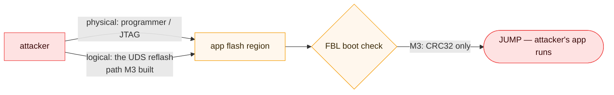

*The attack surface (amber) is the flash region and the boot check that gates it. M3's
CRC check (red outcome) doesn't stop the logical path at all — the attacker signs off
on their own image.*

M3's boot check was a **CRC32** over the image. A CRC is a fine answer to M3's real
risk — *an interrupted flash* — because it proves the image is **complete and
uncorrupted**. But a CRC proves nothing about *who wrote the image*: it's a public,
keyless function, so an attacker programs their app and appends a perfectly valid
CRC. Integrity is not authenticity.

> **Honest label.** The threat M4 defends is a *tampered or forged image*. It does
> **not** defend a runtime-compromised CM4 rewriting live RAM, and it assumes the boot
> ROM launched an honest FBL (more on that in §3). Naming what you *don't* cover is
> half of a threat model.

## 2. Just enough crypto — and exactly why this crypto

Authenticity means the FBL can answer *"was this image produced by someone I trust?"*
The whole design turns on one constraint:

> **The verifier must be able to *check* authenticity without holding a secret that
> could *forge* it.**

That single sentence decides everything downstream, so it's worth seeing why the two
families of cryptography answer it differently.

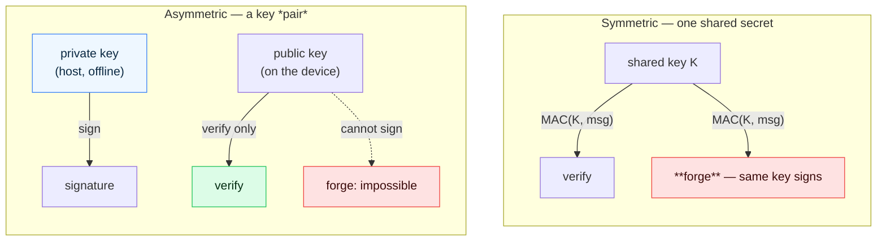

*Symmetric: the key that verifies is the key that forges — put it on a device to let
it check, and cracking one device open forges for the whole fleet (red). Asymmetric:
the device holds only the **public** key; extract it and you can verify, never forge
(green). That's why secure boot is a **signature**, not a MAC.*

So secure boot uses **asymmetric** crypto: a private key **signs** (kept off the
device entirely — §4), a public key **verifies** (safe to ship on every device). Two
more concept choices fall out:

- **Sign the hash, not the image.** A signature operation is expensive and works on a
  fixed-size input, so you hash the whole image to a 32-byte digest first and sign
  *that*. The hash binds every byte of the image to the signature; change one byte and
  the digest — and the check — fails. We use **SHA-256**.
- **ECDSA P-256, not RSA.** Both are asymmetric-signature standards. We chose
  **ECDSA on the P-256 curve**: a 64-byte signature and a 64-byte public key (vs
  RSA-2048's ~256-byte-plus), and — decisively — it's what this part's **hardware
  crypto block accelerates**. The alternative (RSA) has a cheaper *verify* but far
  larger keys/signatures and no HW path here.

> **Honest label — symmetric isn't wrong, it's for a different job.** Symmetric crypto
> comes back in **M5** for authenticated *messaging* (a MAC on runtime CAN frames):
> there, both nodes are trusted endpoints sharing a secret, and the property wanted is
> freshness + mutual authenticity, not "verify without the power to forge." Right tool,
> different problem.

## 3. The root of trust — where checking has to start

A signature check is only as good as the code that runs it. If an attacker can replace
*the verifier*, they don't need to forge anything. So trust has to start at something
**immutable**, and extend outward one verified link at a time:

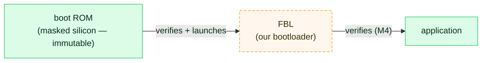

*Each link verifies the next before extending trust. M4 builds the **FBL → app** link
(green). The **ROM → FBL** link (amber, dashed) is designed but deliberately not
enforced on this board — see the honest label.*

> **Honest label — mechanism proven, root not burned.** Enforcing ROM → FBL means
> provisioning the device: fusing the FBL's public-key hash into eFuse and advancing
> the **lifecycle** to SECURE so the ROM refuses an unsigned FBL. That's a *one-way,
> destructive* step. On a development board we run **NORMAL, unprovisioned** lifecycle
> (nothing burned) by standing decision — so we prove the **FBL-verifies-app** link and
> keep the ROM root as design (the fusing story is written up, not executed). The post
> is honest that this is "the mechanism works," not "a production root of trust."

## 4. Keys — where the private one lives, and where the public one doesn't

The asymmetry from §2 only pays off if the private key is *actually* private:

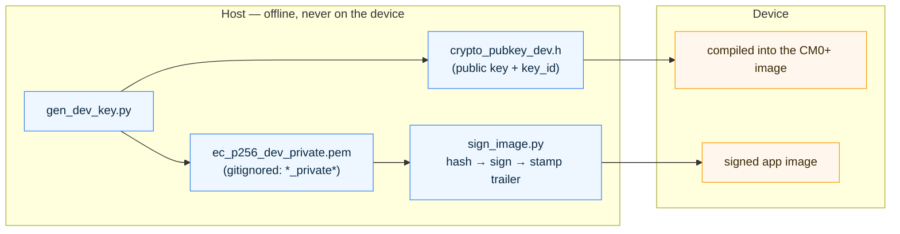

*The private key is born on the host and never leaves it; signing is an offline step.
Only the **public** key (and a `key_id`) ships — compiled into the CM0+ image, because
a public key isn't a secret.*

- **Private key:** generated by `gen_dev_key.py`, kept host-side, **gitignored**
  (`*_private*`). Signing an image is an offline host operation (`sign_image.py`). The
  device never sees it.
- **Public key:** it's *public* — safe on the device. It's compiled into the CM0+
  image with a **`key_id`** so the image can name *which* key signed it, leaving room
  for rotation and multi-key policy later (one key row today).
- **The manifest** rides in the image trailer — and this is where M4 meets M3:

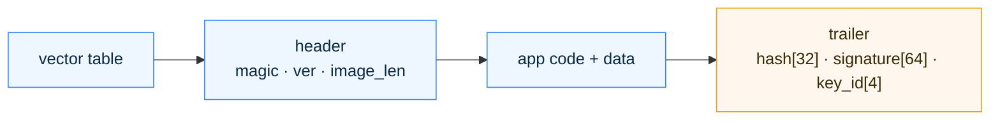

*The hash covers the blue span `[base .. base + image_len)` and stops exactly at the
trailer — the signature field is never inside the range it protects. This is **M3's
image layout, unchanged**: M3 put a CRC32 in that trailer; M4 puts `hash + signature +
key_id`. The verify algorithm changed; the geometry didn't.*

> **Honest label.** A public key compiled into code flash is inflexible — rotating it
> means rebuilding the CM0+ image. The better long-term home is a **dedicated work-flash
> key store**, provisioned separately (noted for later; it's also where M5's *secret*
> key would live). For a *public* key the property that matters isn't secrecy, it's
> **integrity** — an attacker mustn't be able to swap in their own public key — which is
> exactly what the wall in §7 protects.

---

# Part II — The design

## 5. The CM0+ as a crypto coprocessor (a small HSM)

TRAVEO™ T2G is an **asymmetric** dual-core part: a 160 MHz Cortex-M4F (runs the app and
the FBL — the big, attacker-reachable code) and a 100 MHz Cortex-M0+ (a
peripheral/security core). M4 uses the CM0+ deliberately as a small **HSM**: the FBL
doesn't compute the verdict itself, it *asks the CM0+* to. Three reasons drive that,
and only the third is obvious:

1. **The hardware crypto block belongs to the CM0+.** The `CRYPTO` engine is a CPUSS
   sub-block; the CM0+ owns it and drives the vetted primitives (`Cy_Crypto_Core_*`).
   No hand-rolled crypto anywhere — the whole point is to *use* the accelerator, and
   it lives on that side.
2. **TCB isolation.** The FBL's largest attack surface is its CAN/UDS parser — a lot of
   attacker-controlled bytes. Keeping the key and the crypto engine on the *other* core
   means a memory-safety bug in that parser can't reach crypto state or key material.
   (This is a claim, not a wish — §7 makes the bus enforce it.)
3. **The trusted core checks reality.** The FBL asks *"verify the image at
   `[base, len)`"* — and the **CM0+ reads that flash itself** and hashes it. The CM4
   never hands over a digest it computed; it can't feed a convenient lie. The trusted
   core verifies the bytes actually on the chip.

The crypto path is a **layered stack**, and — as in M1–M3 — everything except the
final hardware call is hardware-independent and unit-tested on a PC:

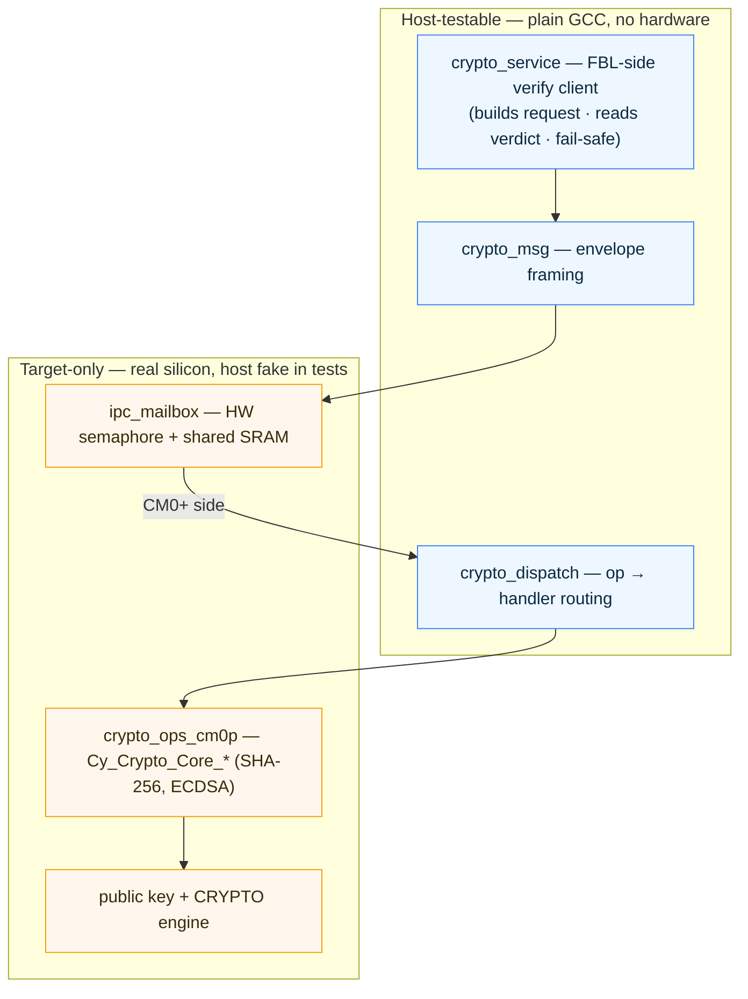

*Blue = the framing, dispatch, and verify client that unit-test on a PC (again, the
boundary the silicon bugs never crossed). Amber = the two things that need the chip:
the IPC transport and the HW crypto handlers. The CM4 talks to the CM0+ only across the
mailbox — never to the key or the engine directly.*

End to end, one boot verify is a single request/response across the mailbox:

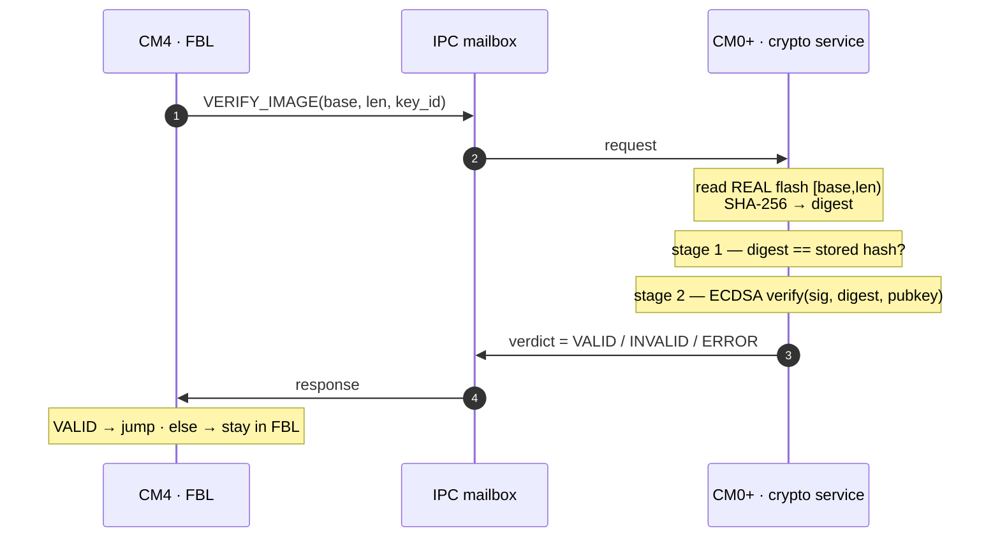

*Two stages, because they localize the failure: stage 1 (hash) separates "corrupt or
truncated image" from stage 2 (ECDSA) "wrong or missing signature." The CM4 only ever
learns a verdict.*

## 6. The verify seam paid off

Here's the M3 bet, collected. M3 built the image check as a **Strategy** behind one
interface: the boot decision and the UDS `check-image` routine call *"verify this
image"* and never learn *how*. M3's how was CRC32. M4's how is *ask the CM0+ for a
signature verdict.*

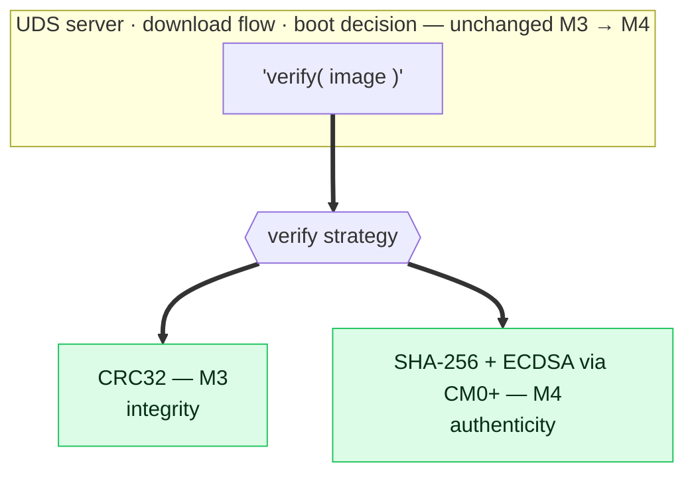

*The prediction held: swapping CRC32 for the CM0+ signature check was a change **behind
the interface only**. The UDS server, the download sequence, and the boot decision are
byte-for-byte the same as M3. If M4 had needed to reshape the download, the seam would
have been in the wrong place — it wasn't.*

The boot decision itself is M3's tree with exactly one box upgraded:

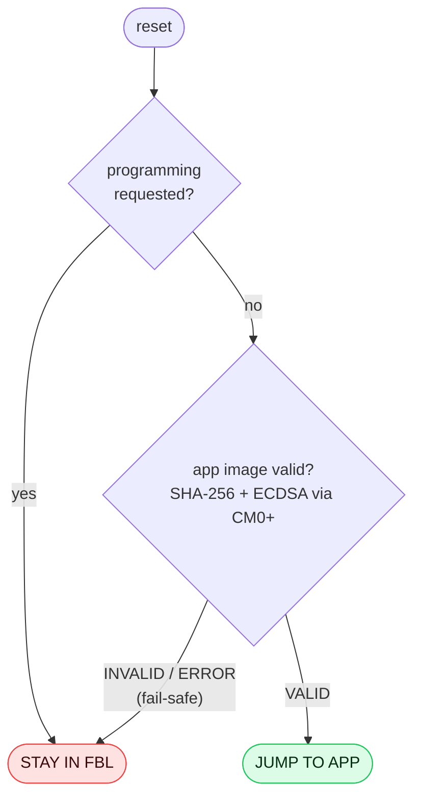

*Same decision M3 shipped (knock window, boot-loop counter, `.noinit` handshake all
still there, elided for clarity). The only change: step 4's "digest check" is now a
delegated signature verdict — and, as ever, **anything that isn't a clean VALID keeps
the FBL resident.***

## 7. The wall — making "the CM4 can't reach the key" true

Reasons 2 and 3 in §5 are *claims*. Until M4's Seam 5 they were also just… true by
construction — the code simply didn't have the CM4 touch the key. But *"no code path
reaches it"* is a convention, not a boundary. A wild pointer in the CAN/UDS parser
could scribble anywhere the **bus** lets the CM4 go. Seam 5 makes the bus the enforcer.

The tempting-but-wrong answer is the CM4's own ARM MPU:

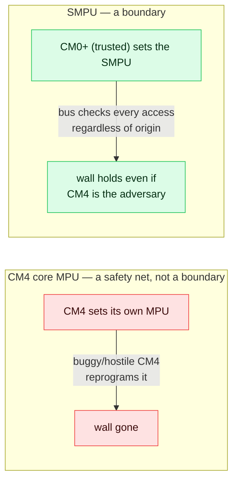

*A core administers its own MPU, so hostile code just turns it off — a safety net, not
a security boundary. The **SMPU** (Shared Memory Protection Unit) is configured by the
trusted CM0+ and enforced by the bus fabric on every transaction, so the wall holds
even when the CM4's program is the adversary.*

The mechanism is **protection contexts**: every bus master carries a context tag, and
the SMPU allows or denies a region by tag. The CM0+ moves the CM4 into an *untrusted*
context and denies that context the CM0+ image flash (where the public key lives):

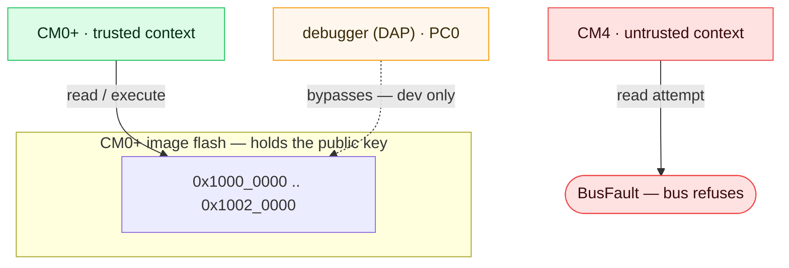

*Proven on silicon: a debug-build CM4 routine reads the key region and takes a precise
**BusFault** (`BFAR = 0x1000_0000`), against a walls-off control where the identical
read succeeds. That delta **is** the proof — and it's driven by CM4 code, not a
debugger read (the DAP is a separate master that bypasses, which is exactly why our
`mdw` dumps always worked).*

> **Honest label — one wall shipped, and the discipline to stop there.** The full plan
> was two walls (the key **and** the CRYPTO engine) plus a lock so the CM4 can't disable
> them. Only the **key SMPU** is shipped-and-proven. The CRYPTO-engine wall and the
> tamper-lock are **design-only, deferred to M5** — and *redundant* for M4 on purpose:
> the CM4 never touches the CRYPTO engine (all crypto crosses the mailbox), and the only
> persistent secret — the key — is already walled. Proving the crown jewel is
> unreachable, and declining to over-build a wall the architecture already makes moot,
> is the stronger result. M5's *runtime* secret key, which lives in the engine, is where
> that second wall stops being redundant.

## 8. The fail-safe — a verifier that can't be trusted is a verifier you don't jump on

Secure boot's honest threat isn't only a forged image; it's also a **verifier that
doesn't answer** — a hung, crashed, or lying CM0+. The rule is unforgiving and simple:
*never jump to an app you couldn't verify — even a good one.* Every failure the FBL
can hit on the crypto path collapses to one verdict:

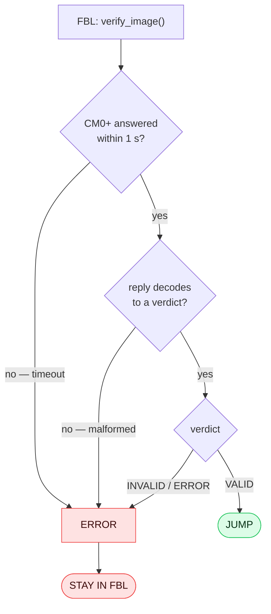

*The wait is **bounded** (a 1 s timeout over a real millisecond clock, not a spin
count) and every non-VALID path — timeout, malformed reply, bad verdict — becomes
`STAY IN FBL`. Proven on silicon by compiling the CM0+ to play dead (→ 1 s timeout →
stay) and to corrupt its reply (→ decode reject → stay): the same good app that boots
with a live verifier does not boot when the verifier can't be trusted, and the FBL
never hangs.*

---

# Part III — Cost, driving it, and what's next

## 9. What secure boot costs at boot (illustrative)

Secure boot adds a **one-time** cost to a single boot: hash the image, verify one
signature, on the 100 MHz CM0+, across one mailbox round-trip. It is not a hot path —
it runs once, before the jump.

| Parameter | Value |
|---|---|
| Hash | **SHA-256** over `[base, image_len)` (HW-accelerated) |
| Signature | **ECDSA P-256** verify over the 32-byte digest (HW-accelerated) |
| Transport | one **IPC mailbox** round-trip (coarse RPC — request the range, get a verdict) |
| Verifier clock | **100 MHz** Cortex-M0+ |
| Fail-safe bound | **1 s** — the max the FBL waits before giving up and staying resident |

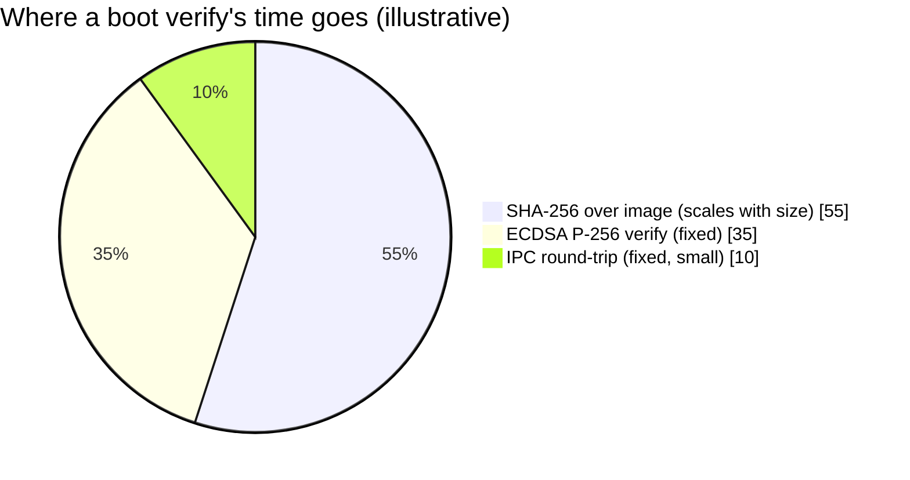

*Illustrative — not instrumented to the microsecond. The shape is the point: the hash
scales with image size while the signature and the mailbox round-trip are fixed, so
for a body-domain app of tens of KB the SHA dominates and the whole thing is a
sub-second, once-per-boot cost. The coarse RPC (one round-trip for the whole range,
not a stream of blocks) keeps the transport slice tiny — a deliberate choice, since
the CM0+ hashing real flash needs the range, not the bytes.*

## 10. User manual — sign it, flash it, verify it, break it

Assumes the FBL + CM0+ image are on the board and the app is built.

**Generate a dev key (once):**
```bash
python host_tools/gen_dev_key.py     # → ec_p256_dev_private.pem (host-only) + public-key header
```

**Sign an app image:**
```bash
python host_tools/sign_image.py node_a_gateway/app/build/gateway_app.hex
# hashes the body, signs the hash, writes the hash+signature+key_id trailer → app_stamped.hex
```

**Flash it over the M3 UDS path — verbatim:**
```bash
python host_tools/uds_flash/uds_flash.py node_a_gateway/app/build/app_stamped.hex
```

**Verify success:** after the flow's `ECUReset`, the FBL reboots, asks the CM0+ to
verify the freshly-written image, and — on `VALID` — jumps. **The app's LED returns on
its own, no power cycle.** That autonomous jump, gated by a real signature check, is
the end-to-end proof.

**The failure demos — the best part (do all four):**

| Break | What the FBL does | What it proves |
|---|---|---|
| Flip one byte of the signed image | stage-1 hash mismatch → `INVALID` → **stay** | integrity |
| Sign with the wrong private key | stage-2 ECDSA fail → `INVALID` → **stay** | authenticity |
| Halt/kill the CM0+ verifier | 1 s timeout → `ERROR` → **stay** (visible ~1 s delay) | availability / fail-safe |
| CM4 debug routine reads the key | **BusFault** (`BFAR = 0x1000_0000`) | the wall (TCB isolation) |

*Each is a one-line change and each demonstrates a distinct property. The last one is
the money shot: the untrusted core physically cannot read the key it would need to
forge trust.*

---

## 11. The thesis, and the next bet

**The seam held.** M3 designed the verify step as a Strategy and predicted M4 would
slot in behind it. It did — the signature check is a swap behind one interface, and the
UDS server, download flow, and boot decision never moved. M3, M4, and M5 aren't three
features bolted on in a row; they're one security stack, designed once, where each
milestone lands as a module behind stable seams.

**Honest, once more, in one place:** the root of trust is *mechanism-proven, not
burned* (NORMAL lifecycle, no eFuse); the CRYPTO-engine wall and the tamper-lock are
*design-only* (redundant for M4); the key is a *dev* key. Every one of those is a
deliberate line between "the mechanism is real" and "this is a provisioned production
root" — and each has a milestone where it becomes real.

**M5 — authenticated messaging (SecOC), and the return of symmetric crypto.** Secure
boot was asymmetric because the device had to verify without the power to forge.
Runtime message authentication is the opposite situation: two *trusted* nodes, sharing
a secret, want each CAN frame to prove freshness + origin — that's a **symmetric MAC**,
the tool §2 set aside. And it changes two things that make M4's deferred work
non-redundant at last:

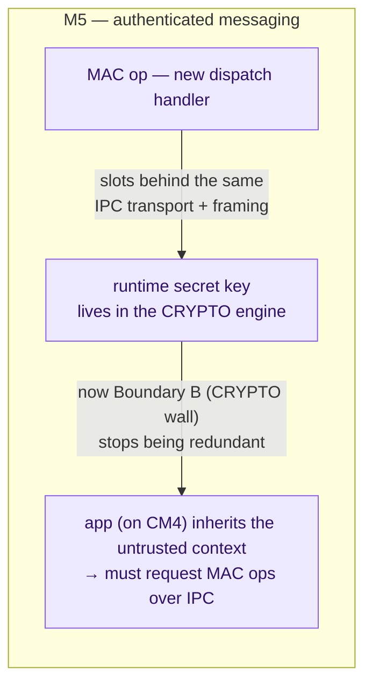

*In M5 the runtime key is a **secret** in the engine, so the CRYPTO-engine wall (M4's
deferred Boundary B) finally earns its keep — and the app, running as the same
untrusted CM4 master, inherits the wall for free and is forced through the IPC service
for MAC ops. One protection-context split, two milestones.*

**The prediction, in writing:** the CM0+ crypto service's dispatch table is additive —
M5's `MAC` op should slot in as **one new handler behind the same IPC transport and
framing**, with the mailbox, the envelope format, and the FBL-side client unchanged. If
it needs the transport reworked, the seam was in the wrong place. Let's find out.

---

*Next: M5 — authenticated messaging between the two nodes. The interesting question
isn't whether a MAC works; it's whether the crypto coprocessor M4 built accepts a new
operation without any of the plumbing around it moving.*
