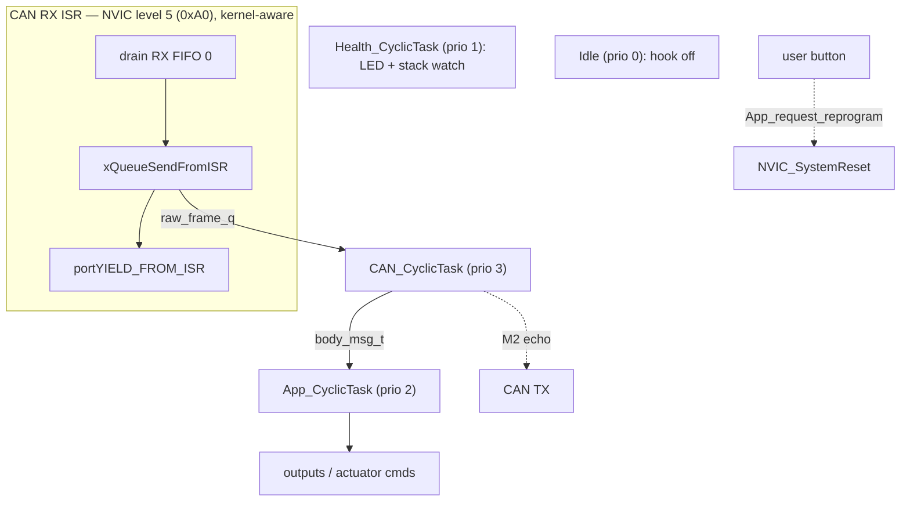
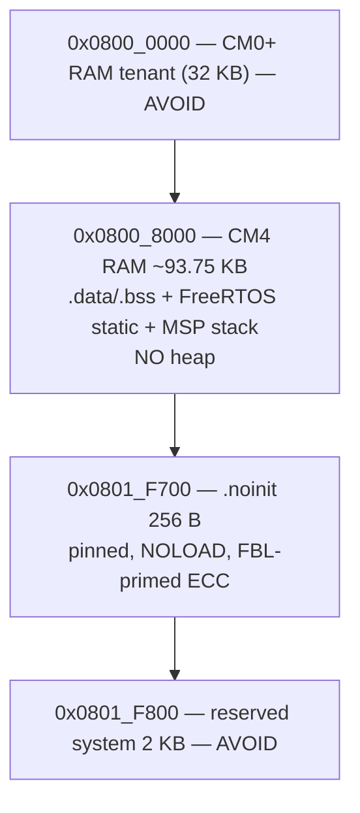

# M2 — design decisions (Node A application on FreeRTOS)

Output of the M2 design discussion (brief: `docs/briefs/M2-app-brief.md`). Decisions are
captured in full in the ADRs; this is the at-a-glance index and the two "shape of the system"
diagrams (OS task table, SRAM layout). Bring-up follows the M2-1 order: **FreeRTOS → CAN →
`.noinit`/reprogram**, one seam at a time.

- **ADR-0010** — FreeRTOS integration (port, tick, allocation, IRQ model, tasks, handover).
- **ADR-0011** — CANFD channel config.
- **ADR-0007 (D7–D9)** — App-side `.noinit` write, linker pinning, ECC ownership.

## Decision index

| Area | Decision | ADR |
|---|---|---|
| Port | `ARM_CM4F`, FPU on, stacks sized for the FP frame (~136 B) | 0010 D1 |
| Tick | SysTick @ **1000 Hz** | 0010 D1 |
| Allocation | **Heap forbidden** — `configSUPPORT_DYNAMIC_ALLOCATION = 0`, all-static, link-time guarantee | 0010 D2 |
| IRQ model | `__NVIC_PRIO_BITS = 3`; `MAX_SYSCALL` = lvl 2 (`0x40`), `KERNEL` = lvl 7 (`0xE0`); BASEPRI critical sections | 0010 D3 |
| Context switch | PendSV/SVC at lowest priority; FPU lazy stacking (design-essay) | 0010 D4 |
| Tasks | 3 app tasks + idle + timer daemon; **hybrid cyclic** (block-on-queue-with-period-timeout); `configMAX_PRIORITIES = 5` | 0010 D5 |
| Test seam | `bodyctl_step(state, *msg, *out)` pure; queue handle confined to task adapters; enforced by host build | 0010 D6 |
| Handover | Trust the B3 contract; defensive `PENDSTCLR` re-clear; 1–2 bring-up asserts | 0010 D7 |
| Watchdog | **OFF** across FBL→app (CM0+ disables it); BREG counter is M2's only net (resets, not hangs); WDT → M6 | 0010 D7 |
| CAN | One channel, **full CAN FD** 500 k nominal / 2 M data + BRS; `RF0N` ISR @ lvl 5 → queue → task; HAL + host fake | 0011 |
| `.noinit` | Pinned **`0x0801_F700` / 256 B** via shared `noinit.ld` in both linkers; FBL `SRAM` origin → `0x0800_8000` | 0007 D8 |
| ECC | App = consumer; **FBL = sole primer** | 0007 D9 |
| Reprogram | App writes handshake + `NVIC_SystemReset`; sw-reset+request ⇒ **counter clear** (M2-5 test); trigger = user button | 0007 D7/D9 |

## OS task table

Five statically-allocated tasks. **Task priority (0 = idle, higher = more urgent) is the
opposite direction to Cortex-M interrupt priority (0 = most urgent)** — kept separate in code.

| Task | Prio | Trigger / period | Job | Stack (words) | Alloc |
|---:|:---:|---|---|:---:|:---:|
| Timer daemon | **4** | FreeRTOS internal | software-timer callbacks (short, non-blocking) | 160 | static |
| `CAN_CyclicTask` | **3** | `raw_frame_q` or period | drain queue → `unpack_*` → route; echo (M2) | 256 | static |
| `App_CyclicTask` | **2** | app msg or period | `bodyctl_step` — body-control state machine | 256 | static |
| `Health_CyclicTask` | **1** | period | heartbeat LED + stack high-water; **M6:** WDT service | 160 | static |
| Idle | **0** | runs when nothing else | FreeRTOS idle; **hook off** | 128 | static |



**Priority rationale:** CAN drains above app-logic (deferred-interrupt split, avoid RX
overrun); health lowest of ours (its starvation is itself a fault signal); timer daemon top so
callbacks fire timely. The ISR→task handoff is `xQueueSendFromISR` + `portYIELD_FROM_ISR`, so a
frame wakes `CAN_CyclicTask` on ISR exit, not on the next tick.

## SRAM layout (128 KB @ `0x0800_0000`)

The dual-core RAM tenant (CM0+) and the BSP's reserved top-2 KB are both off-limits to the CM4
app; `.noinit` is pinned between them and excluded from the CM4 RAM region.

```
0x0800_0000  ┌───────────────────────────────┐
             │ CM0+ RAM tenant       32 KB   │  CM0+ (security/peripheral core) — AVOID
0x0800_8000  ├───────────────────────────────┤
             │ CM4 RAM                       │  app: ~93.75 KB usable
             │  .data / .bss                 │   • FreeRTOS static TCBs + stacks (~4.3 KB)
             │  FreeRTOS static objects      │   • raw_frame_q storage (~1.2 KB)
             │  MSP / ISR stack (4 KB)       │   • app + PDL/driver state
             │  (NO heap — forbidden)        │   • ~84 KB headroom
0x0801_F700  ├───────────────────────────────┤
             │ .noinit handshake     256 B   │  PINNED (shared noinit.ld), NOLOAD,
             │   magic+ver+mode+crc32        │  survives warm reset, FBL-primed ECC
0x0801_F800  ├───────────────────────────────┤
             │ reserved "system use"  2 KB   │  BSP rule — AVOID
0x0802_0000  └───────────────────────────────┘
```



**Why pinned here:** above the CM0+ tenant (safe from the other core) and below the BSP's
reserved 2 KB (M1 wrongly placed it *inside* that 2 KB). The address is defined once in
`shared/boot/linker/noinit.ld` and `INCLUDE`d by both the FBL and app linkers, so the two
images can never disagree. To stop a ModusToolbox BSP regeneration from silently reverting the
pin, the app **forks `app_cm4.ld` into a repo-owned linker** (as the FBL owns `fbl.ld`) plus a
link-time `ASSERT` on the address. The FBL `SRAM` origin is also corrected to `0x0800_8000` so
the bootloader's own RAM stops overlapping the CM0+ tenant.

## Memory budget (CM4 app RAM ≈ 93.75 KB)

| Consumer | Estimate | Note |
|---|---:|---|
| FreeRTOS task stacks (5) | ~3 KB | sized from on-silicon high-water (idle/timer/health 128 w, app/can 192 w); used 11–88 w |
| TCBs (5 × `StaticTask_t`) | ~0.5 KB | static |
| `raw_frame_q` (16 × ~72 B) | ~1.2 KB | CAN ISR → `CAN_CyclicTask` (raw frames) |
| `app_msg_q` (8 × `body_msg_t`) | ~0.2 KB | `CAN_CyclicTask` → `App_CyclicTask` (decoded) |
| MSP / ISR stack | 4 KB | handlers run on MSP |
| App `.bss`/`.data` + PDL | remainder | ~84 KB headroom |
| **Heap** | **0 KB** | forbidden (link-time guarantee) |

## Deliverables tracking (from the brief)

1. ✅ Design discussion (this doc + the ADRs).
2. ✅ ADRs — 0010 (FreeRTOS), 0011 (CANFD), 0007 D7–D9 (`.noinit` app side).
3. ✅ App skeleton — `FreeRTOSConfig.h`, `main()`, task stubs, CAN + `.noinit`/`app_port` HAL seams.
4. ✅ Unity tests — `bodyctl`, routing via `body_decode`, `.noinit` encode + the M2-5
   "N reprograms ⇒ no boot-loop trip" test. `make test` green.
5. ✅ Implemented + green. Target port done: FreeRTOS/MTB build, CANFD driver, LED/button
   path, the FBL linker fork (`fbl_cm4.ld`), the dedicated `.fbl_handshake` pin.
6. ✅ On-board bring-up (M2-1 order) — see `M2-bringup_log.md`:
   - ✅ Seam 1: FreeRTOS + heartbeat (LED4/P12.2).
   - ✅ Seam 2: CANFD echo — internal loopback, then **real bus** (VN1610 via
     `host_tools/can_echo_probe/`, 10/10 FD frames echoed).
   - ✅ Seam 3: App→FBL `.noinit` reprogram — closes the deferred M1 thread on silicon.
   - Button (SW1/P7.0) + measured stack trim done. **M2 complete.**
